# Create: Wareworks

> Mechanical Storage & Intralogistics for Create

Create: Wareworks is an addon for [Create](https://github.com/Creators-of-Create/Create) that adds physical, automated
high-bay warehouses. Racks of chests, barrels and vaults line an aisle, and a kinetic **stacker crane** travels down it
to store and retrieve items. Nothing is teleported: every item you put in or take out is carried by the crane, where you
can watch it happen.

**The machine is the feature.**

## Screenshots

| | |
|---|---|
| 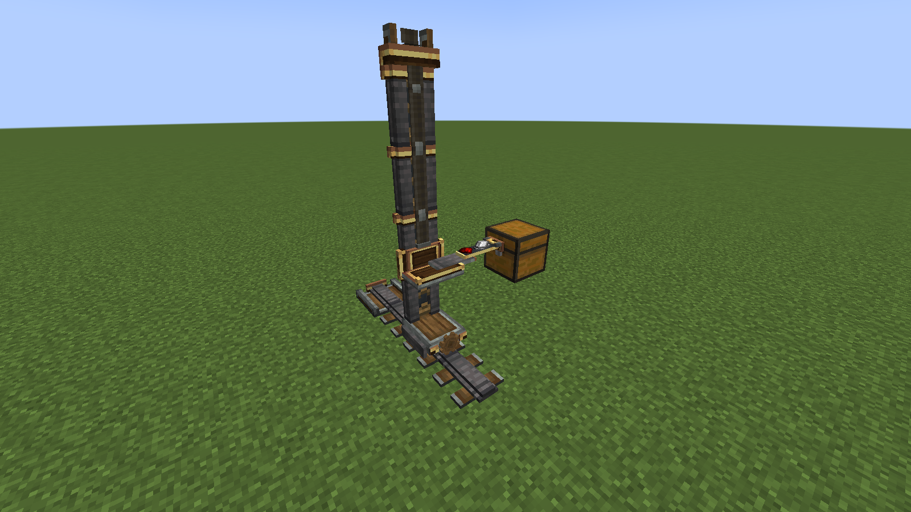 | 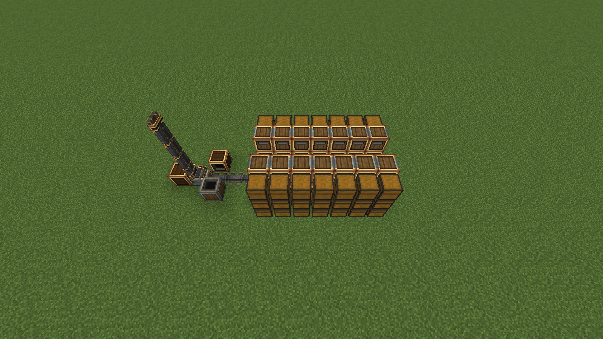 |
| The crane: chassis on bogies, a braced mast with brass flanges, lift carriage, telescopic arm and grabber reaching into a chest. | A whole aisle: crane dock, rail line, controller, input and output station, and three levels of storage locations on both sides. |
| 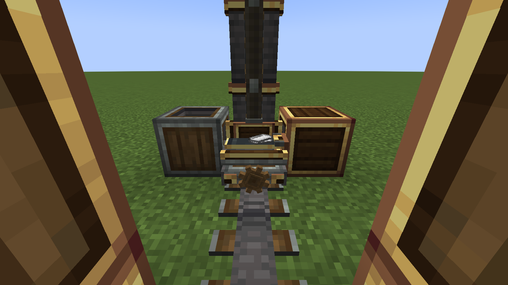 | 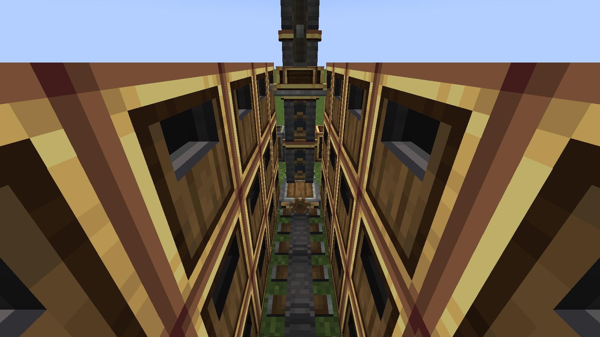 |
| Travelling to a storage location with items on the arm; the drive cog turns with the kinetic network. | Looking down the aisle: the arm reaches through the port of a storage location. |

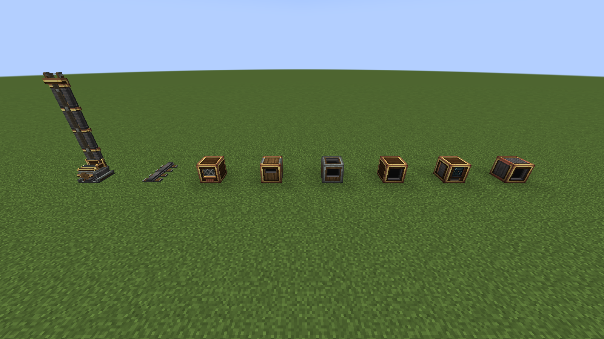

| | |
|---|---|
| 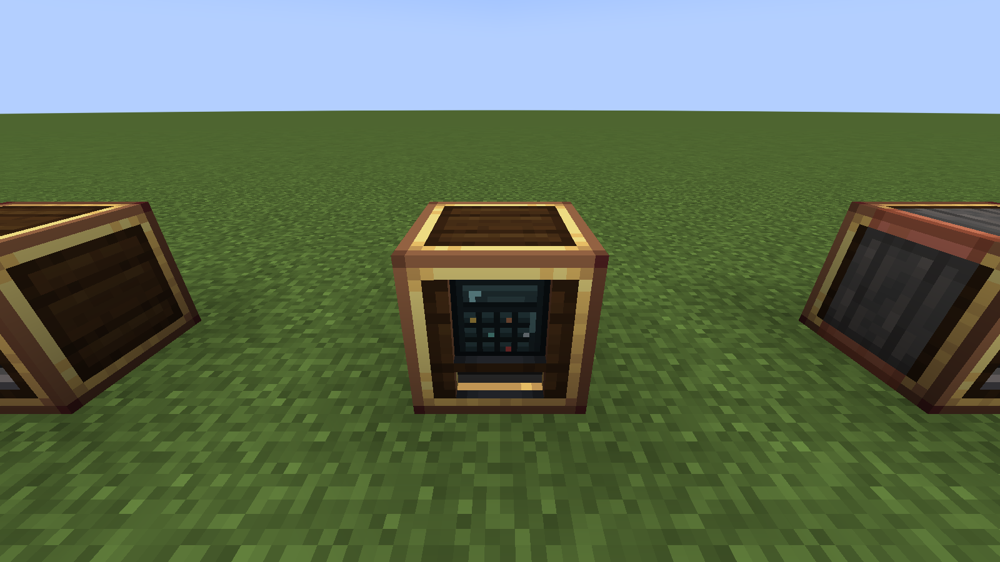 | 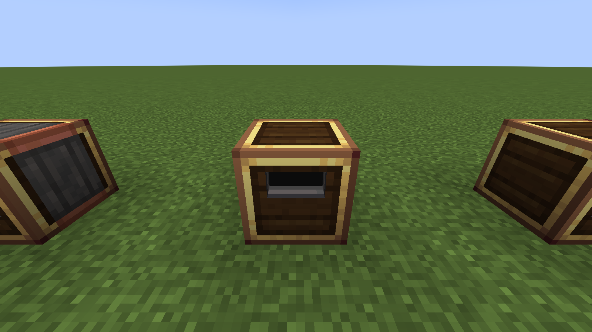 |
| The warehouse terminal from the player's side: a recessed display and a take-out tray where requested items come out. | The same block from the aisle, where the crane reaches in through the arm port. |

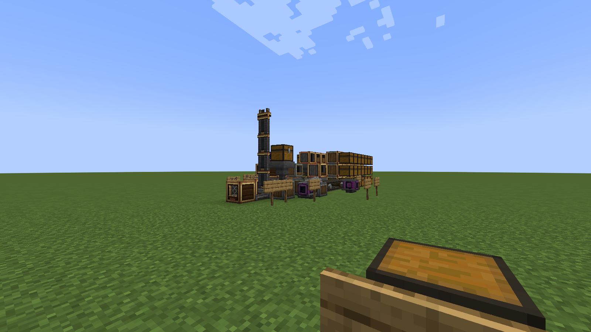

| | |
|---|---|
| 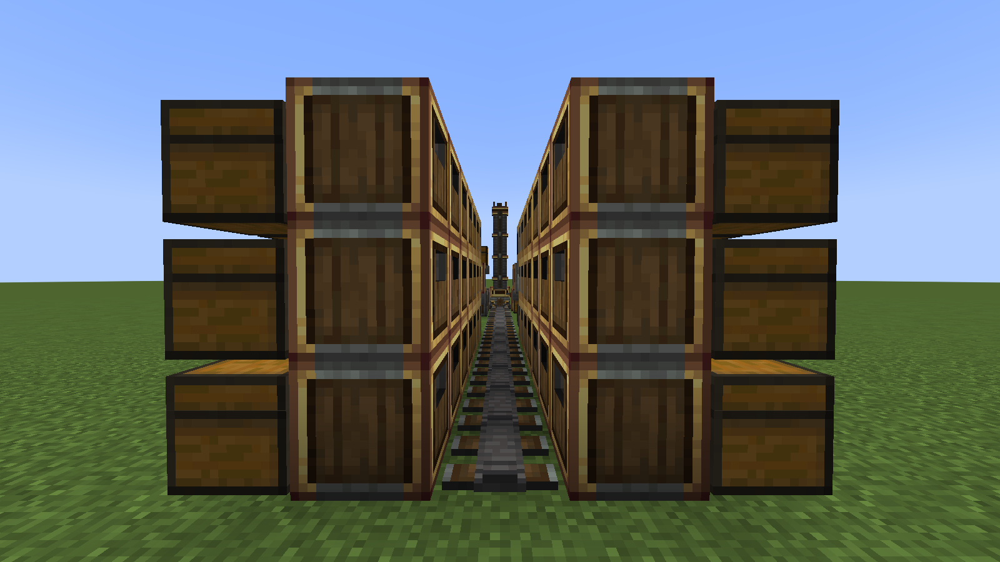 | 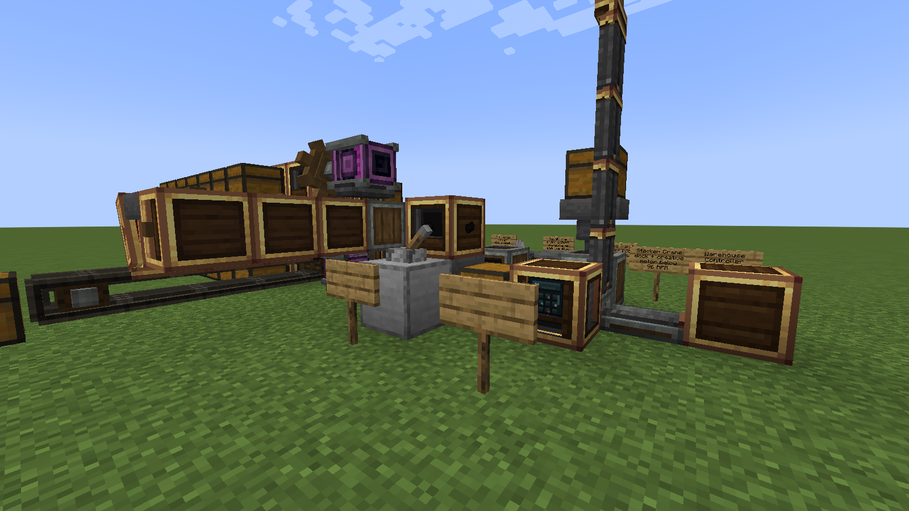 |
| Storage locations on both sides across three levels, the rail line down the middle and the crane at the dock. | The output side: the brass output with its filter item, the lever that requests it, and a hopper draining into a chest. |

## Features

* **Stacker Crane** (dock block): a kinetic machine on a rail aisle. Its crane (base with bogies, braced mast, lift
  carriage, telescopic arm, grabber, drive cog) is fully animated; travel, lift and arm speed follow the RPM. Create-like
  sounds for travel, rail joints, lift, arm, picking and dropping.
* **Warehouse Rail**: lays out the aisle; its length is the straight rail line in front of the dock.
* **Warehouse Controller**: sits behind the dock, gives the aisle its letter, finds storage locations and stations, keeps
  a stock index and plans store and retrieve jobs. It never moves items itself.
* **Warehouse Interface**: turns any inventory with an item capability (chests, barrels, Create vaults, modded storage)
  into an addressable storage location such as `A-03-07R`. Its filter slot decides what may be stored there.
* **Warehouse Input**: the andesite hand-over point for belts, funnels, chutes, hoppers and Mechanical Arms feeding the
  warehouse.
* **Warehouse Output**: the brass hand-over point that requests the item in its filter slot on a redstone pulse;
  funnels, chutes, hoppers and Mechanical Arms take the delivered items out.
* **Warehouse Terminal**: a searchable screen showing the aisle's whole stock; click an item and the crane delivers it
  into the terminal.
* **Warehouse Production Station**: holds production patterns; the crane delivers ingredients to it for your own Create
  machines, a funnel, chute, belt or Mechanical Arm carries them on, and the product comes back into storage. Wareworks
  never crafts anything itself.

**Mechanical Arms** can use the stations directly: the warehouse input only as a target to put items into, and the
output, terminal and production station only as a source to take items from. Clicking a station again with the arm
does not switch that. The warehouse interface, controller, crane dock and rails are not arm targets.

**Stock displays** work through Create's **Display Link**, so you build them with the display blocks you already know.
Put a link on the controller or the terminal for an **aisle summary** (letter, status, storage locations in use, item
types, items) or a **stock list** of the most stocked item types; on a warehouse output or interface for the aisle's
**stock of the item in its filter slot**; and on the crane dock for the **crane's status** — what it is doing, what it
carries and which address it is heading for. Nixie tubes, display boards and lecterns show the text in your own
language. A sign accepts it too, but it keeps whatever language the server writes it in — English on a dedicated
server, for everyone — because a sign stores plain text. Create's own display sources behave the same way.

Also included: goggle information on every block, Create-style item descriptions, a Ponder scene for every block,
English and German translations, and recipes at mid-game Create tier.

Items only ever move in the crane's grabber, and nothing is lost or duplicated when blocks break, chunks unload or the
server restarts.

## Requirements

| | |
|---|---|
| Minecraft | 1.21.1 |
| NeoForge | 21.1.250 or newer |
| Create | 6.0.10 |

## Installation

Download from CurseForge (coming soon) and put the jar into your `mods` folder next to Create.

## Quick start: build your first warehouse

The build *is* the configuration; there is no setup screen.

1. **Place the Stacker Crane dock** looking in the direction the aisle should run.
2. **Power it from below.** The dock takes rotational force only through a shaft underneath (4 SU per RPM by default).
   Higher RPM means a faster crane.
3. **Lay Warehouse Rails** in a straight line in front of the dock. Their number is the aisle length (up to 32 by
   default). Scroll the **Mast Height** value box on the dock for the number of levels.
4. **Put the Warehouse Controller directly behind the dock**, facing it. Its **Aisle** value box sets the letter (A–Z)
   that every address in this aisle starts with.
5. **Build the racks.** Put chests, barrels or vaults beside the aisle and a **Warehouse Interface** in front of each,
   brass port towards the inventory, plate towards the aisle. Clicking the side of an interface you already placed
   copies its facing, so a rack row goes up quickly.
6. **Place a Warehouse Input** at a rack position with its opening towards the aisle and feed it with a belt, funnel,
   chute, hopper or Mechanical Arm. The crane stores whatever arrives.
7. **Place a Warehouse Output** the same way. Put the item you want into its filter slot, hold right-click to set the
   amount, and give it a **redstone pulse**: the crane fetches the items and drops them into the output, where a funnel,
   chute or Mechanical Arm can pull them out.
8. **Put on Engineer's Goggles** and look at any block: addresses, stock, reservations, the crane's job and the
   controller's planning result are all shown.

Hold **W** over any Wareworks item for a Ponder scene that shows the same steps. Every block has one: the crane and the
rail share the overview, the controller shows storing and retrieving, the interface adds addressing and storage
filters, and the terminal and the production station have their own scenes (placing and requesting, and feeding a
machine from the warehouse).

## Requesting items

**Warehouse Terminal.** Place it at a rack position while standing where you want to read it: the screen faces you, and
the controller turns the crane's intake port towards the aisle by itself. The wrench turns the screen to another side,
never onto the port. Right-click with an empty hand to open it.

* Type to search; `@create` matches a mod id.
* **Click** to request the amount in the scroll input, **shift-click** for a stack, **ctrl-click** for everything
  available.
* Repeated clicks on the same item are merged into one request and one crane trip.
* Delivered items land in the terminal's own slots. Take them by hand, or let a funnel, chute or Mechanical Arm pull
  them onward.

**Warehouse Output.** No screen: set the filter slot and amount, then send a redstone pulse. This is the automatable
path for your factory.

## Storage filters

Right-click the filter slot on the lower half of a Warehouse Interface's aisle face with an item, and that storage
location only accepts that item. List, Attribute and Package Filters work exactly as elsewhere in Create.

* **An empty slot accepts everything.**
* **Dedicated locations fill first**, before unfiltered ones. A deny-list filter only excludes items, so such a location
  is treated like an unfiltered one.
* **Filters restrict storing only.** Retrieval is never blocked, and changing a filter never moves or deletes stored
  items.
* **Items that match no filter need an unfiltered location.** Without one, the input keeps its items and the
  controller's goggles say that no filter accepts them.

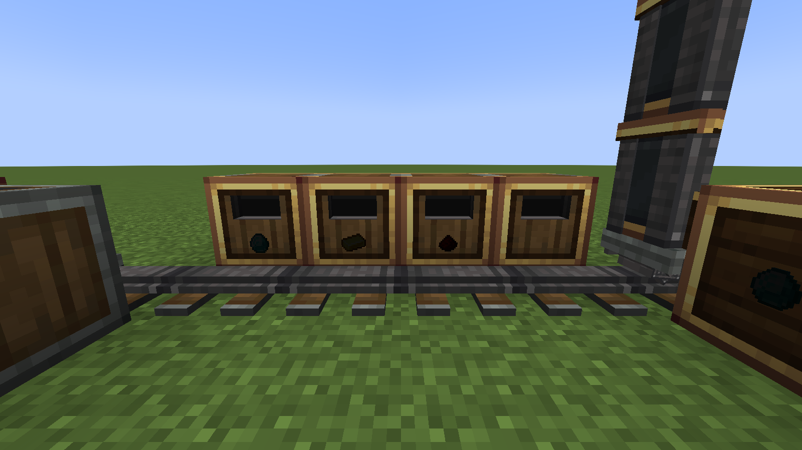

## Production

A **Warehouse Production Station** holds patterns: a 3 × 3 grid of ingredients plus one result. Once a pattern is set,
the result can be ordered at the terminal even at zero stock. The crane delivers the ingredients to the station, your
machine does the work, and the product comes back through an ordinary warehouse input. The terminal shows each order's
state ("waiting for ingredients", "at the machine", "waiting for the result", "complete") and lets you cancel it.
Ingredients that already went into a machine are not recovered.

| | |
|---|---|
| 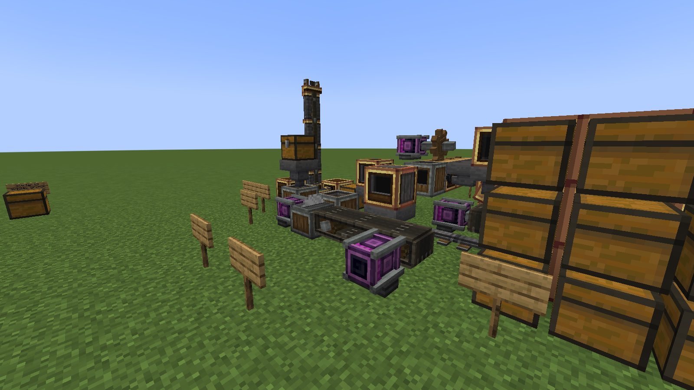 | 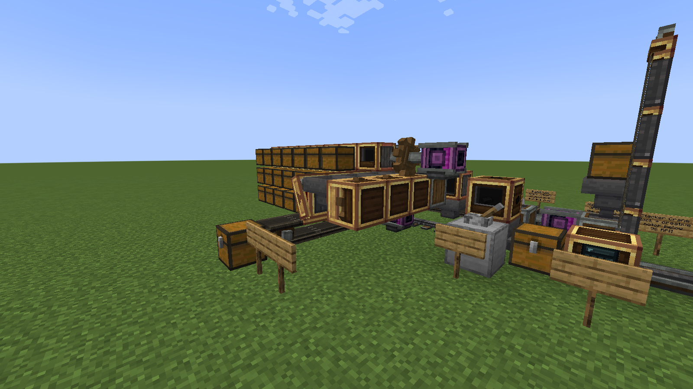 |
| **Sawmill:** station → hopper → belt → Mechanical Saw → warehouse input. Pattern: 1 andesite alloy → 6 shafts. | **Mechanical crafters:** station → belt → three filtered brass funnels → hoppers → Mechanical Crafters → warehouse input. |

Practical notes:

* **A Mechanical Arm can feed your machine straight from the station.** Select the production station as the arm's
  source and the machine as its target; the order moves on to "waiting for the result" once the arm has taken the
  ingredients, just as with a funnel.
* **Mechanical crafters need filtered feeds and hopper buffers.** A crafter slot holds exactly one item, so each funnel
  must be filtered to one ingredient. A crafter also accepts nothing while its group is working, so put a hopper
  between each funnel and its crafter to hold the next ingredient.
* **Give a Mechanical Saw a recipe filter.** Saws also run stonecutting recipes and cycle through every matching
  recipe, so an unfiltered saw makes the wrong item most of the time.
* **Wareworks does not check patterns against recipes.** A pattern whose machine cannot make the result never produces
  anything, and the order times out.

## Building from source

Requires a JDK 21 (`JAVA_HOME` must point to it).

```bash
./gradlew build              # compile, run unit tests, build the jar into build/libs
./gradlew runClient          # development client
./gradlew runServer          # development dedicated server (run/server)
./gradlew runGameTestServer  # in-world GameTests; exit code = number of failures
./gradlew runData            # data generation into src/generated/resources
./gradlew runVisualTest      # client screenshots into run/visual/screenshots
./gradlew runRobustnessTest  # chunk unload, save and rejoin, blocks broken mid-job
./gradlew runShowcase        # builds a playable showcase world into run/showcase/saves
```

On Windows use `gradlew.bat`. To play the showcase world, copy `run/showcase/saves/wareworks_showcase` into `run/saves`,
start `./gradlew runClient` and pick **"Wareworks Showcase"**.

## Documentation

* [Architecture](docs/architecture.md): layers, package tree, design decisions
* [Warehouse system](docs/warehouse-system.md): interface, controller, addressing, stock index, jobs, reservations, config
* [Stacker crane](docs/stacker-crane.md): block, state machine, kinetics, rendering, sounds
* [Dependencies](docs/dependencies.md): versions, Create APIs in use, known harmless log warnings
* [Roadmap](docs/roadmap.md): milestones and planned features
* [Manual test checklist](docs/manual-test-checklist.md): play-test checks

## AI disclosure

* **Images:** artwork such as the project logo was generated with AI. The screenshots in this README are in-game
  captures.
* **Code:** the code was written with AI assistance.
* **Human review:** every AI-generated part, whether image or code, was reviewed by a human before it was released.

## License

Copyright (C) 2026 Richie1710

Create: Wareworks is released under the [GNU General Public License v3.0](LICENSE) (GPL-3.0-only).

You may use, modify and redistribute it, but copies and modified versions must stay under the same license, keep the
copyright and license notices, and make their source code available.

Create, Ponder, Flywheel and Registrate belong to their respective authors; this addon depends on them and ships none of
their code.
