# Create: Wareworks

> Mechanical Storage & Intralogistics for Create

Create: Wareworks is an addon for [Create](https://github.com/Creators-of-Create/Create) that adds physical, automated
high-bay warehouses. Racks of chests, barrels and vaults line an aisle, and a kinetic **stacker crane** travels down it
to store and retrieve items. The rails may **turn corners and split**, so a warehouse can follow the shape of your base
and reach into every room of it: the crane rolls onto the shared block, swings a quarter turn and drives on down the
next aisle, and goods from every aisle of the shape come back to the one block you collect them at. Nothing is
teleported: every item you put in or take out is carried by the crane, where you can watch it happen.

**The machine is the feature.**

## Screenshots

| | |
|---|---|
| 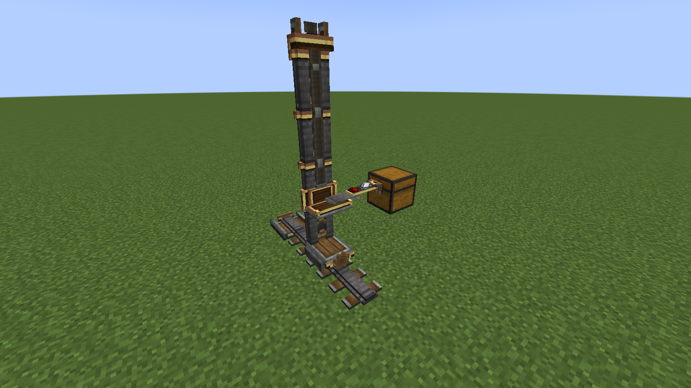 | 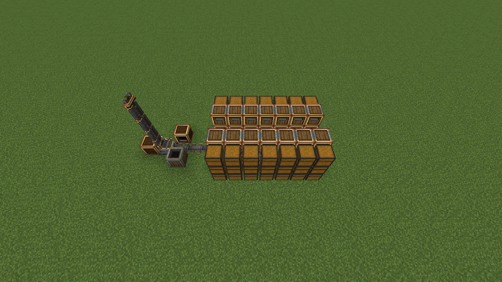 |
| The crane: chassis on bogies, a braced mast with brass flanges, lift carriage, telescopic arm and grabber reaching into a chest. | A whole aisle: crane dock, rail line, controller, input and output station, and three levels of storage locations on both sides. |
| 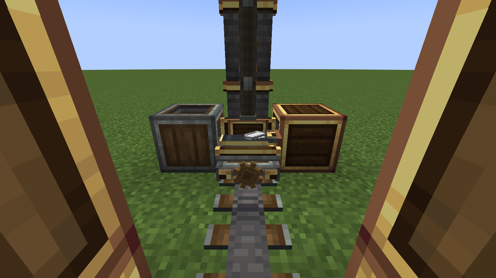 | 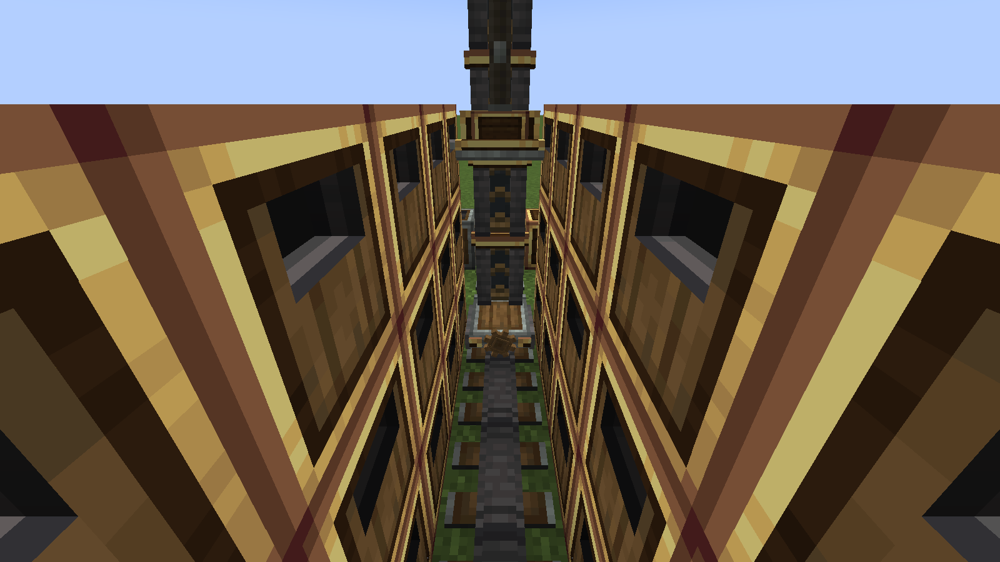 |
| Travelling to a storage location with items on the arm; the drive cog turns with the kinetic network. | Looking down the aisle: the arm reaches through the port of a storage location. |

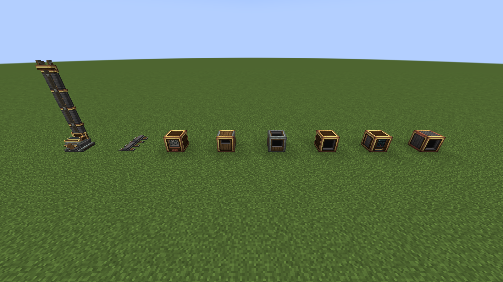

| | |
|---|---|
| 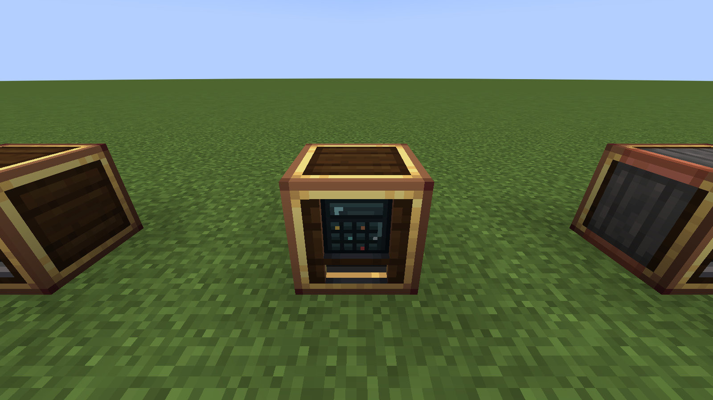 | 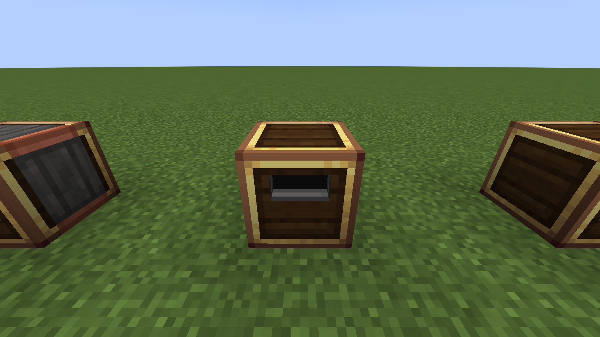 |
| The warehouse terminal from the player's side: a recessed display and a take-out tray where requested items come out. | The same block from the aisle, where the crane reaches in through the arm port. |

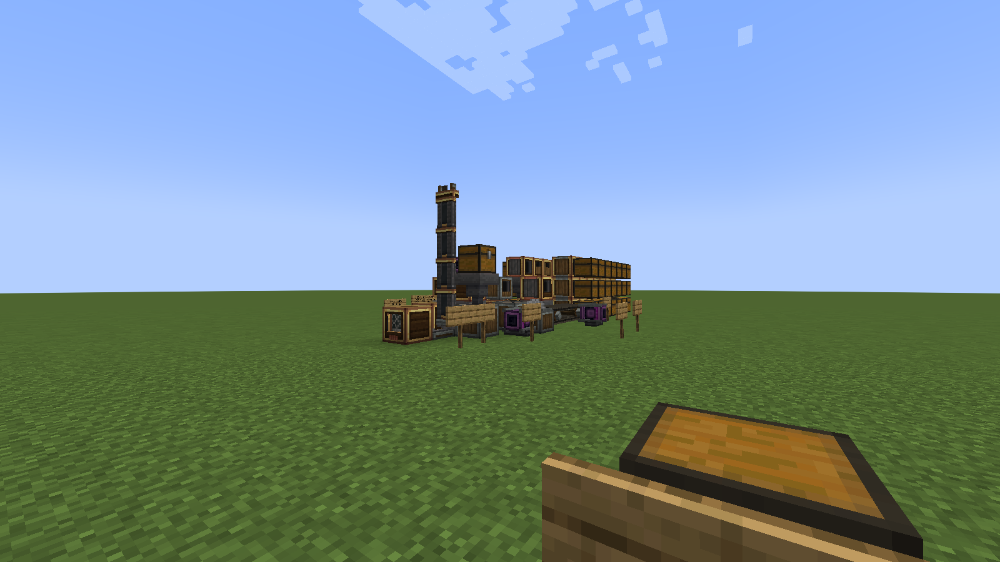

| | |
|---|---|
| 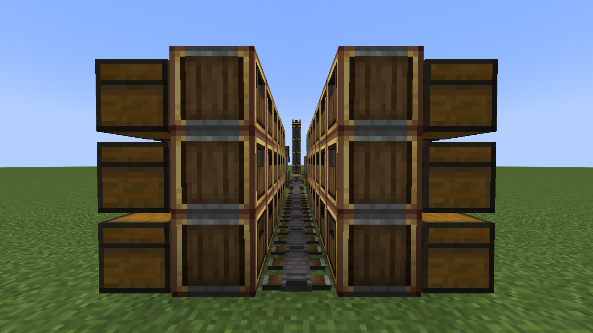 | 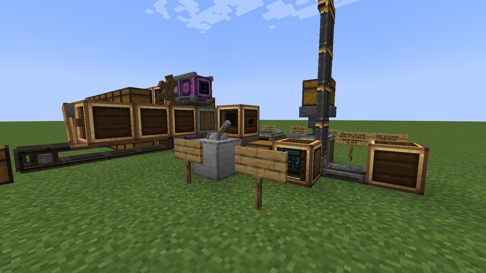 |
| Storage locations on both sides across three levels, the rail line down the middle and the crane at the dock. | The output side: the brass output with its filter item, the lever that requests it, and a hopper draining into a chest. |

## Features

* **Stacker Crane** (dock block): a kinetic machine on a rail aisle. Its crane (base with bogies, braced mast, lift
  carriage, telescopic arm, grabber, drive cog) is fully animated; travel, lift and arm speed follow the RPM. Create-like
  sounds for travel, rail joints, lift, arm, picking and dropping.
* **Warehouse Rail**: lays out the aisles. **Rails that touch connect**, so your warehouse is simply all the rails in
  front of the dock — it may bend round corners, **split** into side aisles and even close into a **ring**, and the
  block two runs share is a corner or a junction the crane turns at. Every straight run is **one** aisle with one
  letter, however many junctions it passes through, and a rack standing beside a corner or a junction belongs to the
  aisle its interface faces away from. A **wrench closes a rail**, which is how you keep one out of the warehouse.
* **Warehouse Controller**: sits behind the dock, letters every aisle of its warehouse (the first from its own value box,
  each further one the next free letter), finds storage locations and stations, keeps a stock index and plans store and
  retrieve jobs. It never moves items itself. Its goggles say how big the warehouse is, which aisles it has and — if the
  rails stop short of what you laid — where and why.
* **Warehouse Interface**: turns any inventory with an item capability (chests, barrels, Create vaults, modded storage)
  into an addressable storage location such as `A-03-07R`. Its filter slot decides what may be stored there, and a
  priority on the same slot decides which of the suitable locations fills first.
* **Warehouse Input**: the andesite hand-over point for belts, funnels, chutes, hoppers and Mechanical Arms feeding the
  warehouse. Put a **Create Packager** against it and it becomes an **in door** for addressed **Create packages**:
  arriving boxes are opened and their contents stored like anything else.
* **Warehouse Output**: the warehouse's **port**, in three directions. It either **requests** the item in its filter slot
  — on a redstone pulse, or continuously while a signal is held, which keeps a machine supplied without a clock — or it
  **accepts** what the warehouse cannot keep, as an overflow behind every rack or as a diversion in front of them, or it
  **collects**: the crane reaches through the port into the inventory behind it and fetches a machine's result into
  storage, so no belt has to lead back to the aisle. Funnels, chutes, hoppers and Mechanical Arms take the items out of a
  requesting or accepting port either way. A **Create Packager** against it makes it an **out door**: what the
  warehouse hands over leaves as a package, addressed by a plain sign. Details in the **The warehouse port** and
  **Packages at the door** sections below.
* **Warehouse Terminal**: a searchable screen showing the whole warehouse's stock; click an item and the crane
  delivers it into the terminal. Its grid is ordered by what there is most of, by what **you** request most often, or
  by name — your choice, remembered for you. Or hand it a whole **list**: put a clipboard — a Schematicannon's material
  checklist, or one you wrote yourself — into its list slot, and the warehouse works the list off in portions and ticks
  each entry off as it delivers it.
* **Warehouse Production Station**: holds production patterns; the crane delivers ingredients to it for your own Create
  machines, a funnel, chute, belt or Mechanical Arm carries them on, and the product comes back into storage. Order
  something whose **ingredients have to be made first** and the whole chain is planned at the click — one order per step,
  at your own machines. Wareworks never crafts anything itself.
* **Warehouse Stock Keeper**: holds the warehouse's stock rules — one item per row plus a **minimum**, a **maximum** and
  a **reserve**. It holds no items itself; a row's item is only a name, and nothing you click into it is used up.
* **Warehouse Home Point**: says "wait here". Place it beside the rails where your next job usually starts and, on a
  warehouse of more than one aisle, the crane drives back and waits in front of it once it has had nothing to do for a
  while — and drops that trip the instant there is real work, even mid-corner. Without one the dock stays the crane's
  home; on a single straight aisle the machine stands where its last job left it, as it always did. One per warehouse:
  a second one lights up red and says so.

**Mechanical Arms** can use the stations directly: the warehouse input only as a target to put items into, and the
output, terminal and production station only as a source to take items from. Clicking a station again with the arm
does not switch that. The warehouse interface, controller, crane dock and rails are not arm targets.

**Stock displays** work through Create's **Display Link**, so you build them with the display blocks you already know.
Put a link on the controller or the terminal for a **warehouse summary** (letter, status, aisles, storage locations in
use, item types, items) or a **stock list** of the most stocked item types; on a warehouse output or interface for the
**stock of the item in its filter slot**; and on the crane dock for the **crane's status** — what it is doing, what it
carries and which address it is heading for. Nixie tubes, display boards and lecterns show the text in your own
language. A sign accepts it too, but it keeps whatever language the server writes it in — English on a dedicated
server, for everyone — because a sign stores plain text. Create's own display sources behave the same way.

**Stock rules** let you tell a warehouse how much of something it should hold. One row of a **Warehouse Stock Keeper**
carries an item and three numbers: a **minimum** the warehouse tries to keep (a comparator on the keeper calls for the
item, and the warehouse even orders it from your own machines), a **maximum** it stores at most, and a **reserve** it
never hands to your automation. Details are in the **Stock rules** section below.

Also included: goggle information on every block, Create-style item descriptions, Ponder scenes for all of them but the
newest (the home point has none yet), English and German translations, and recipes at mid-game Create tier.

Items only ever move in the crane's grabber, and nothing is lost or duplicated when blocks break, chunks unload or the
server restarts.

**A server operator can let an aisle keep itself loaded while it has work**, so a warehouse that restocks, exports or
collects on its own does not stop the moment you walk away. It is a **chunk loader** and it is **switched off** in the
shipped configuration; the **Chunk loading** section below says what it does, what bounds it and how to see every chunk
the mod holds.

## Requirements

| | |
|---|---|
| Minecraft | 1.21.1 |
| NeoForge | 21.1.250 or newer |
| Create | 6.0.10 |

## Installation

Download from CurseForge (coming soon) and put the jar into your `mods` folder next to Create.

## Quick start: build your first warehouse

The build *is* the configuration; there is no setup screen.

1. **Place the Stacker Crane dock** looking in the direction the aisle should run.
2. **Power it from below.** The dock takes rotational force only through a shaft underneath (4 SU per RPM by default).
   Higher RPM means a faster crane.
3. **Lay Warehouse Rails** in a line in front of the dock. Their number is the aisle length (up to 32 by
   default). Scroll the **Mast Height** value box on the dock for the number of levels.
   *You may bend and split:* lay a second run at right angles to the first and the block they share becomes a corner
   the crane turns at; a rail leaving a run **sideways** makes a junction and starts the next aisle. A T, a cross, a
   comb of side aisles and even a ring are all **one** warehouse, and every straight run keeps **one** letter however
   many junctions it passes through. Close a rail you want left out with a **wrench**.
4. **Put the Warehouse Controller directly behind the dock**, facing it. Its **Aisle** value box sets the letter (A–Z)
   the aisle at the dock starts with; any further aisle gets the next free letter by itself.
5. **Build the racks.** Put chests, barrels or vaults beside the aisle and a **Warehouse Interface** in front of each,
   brass port towards the inventory, plate towards the aisle. Clicking the side of an interface you already placed
   copies its facing, so a rack row goes up quickly.
6. **Place a Warehouse Input** at a rack position with its opening towards the aisle and feed it with a belt, funnel,
   chute, hopper or Mechanical Arm. The crane stores whatever arrives.
7. **Place a Warehouse Output** the same way. Put the item you want into its filter slot, hold right-click to set the
   amount, and give it a **redstone pulse**: the crane fetches the items and drops them into the output, where a funnel,
   chute or Mechanical Arm can pull them out. The same block is also the warehouse's **overflow** — hold right-click on
   it with a **wrench** to turn it around (see **The warehouse port**).
8. **If your rails bend, place a Warehouse Home Point** at a rack position where you want the crane to wait — beside the
   terminal is the usual choice. Its plate faces you like every station, its lamp comes on once your crane really uses
   it, and the crane drives back to it whenever it has had nothing to do for a few seconds. Skip this and the dock stays
   its home; on a single straight aisle the machine stands where its last job left it, as it always did.
9. **Put on Engineer's Goggles** and look at any block: addresses, stock, reservations, the crane's job and the
   controller's planning result are all shown.

Hold **W** over any Wareworks item for a Ponder scene that shows the same steps. Nine of the ten blocks have one — the
home point is the exception, it has no scene yet: the crane and the rail share the overview, the controller shows storing
and retrieving, the interface adds addressing and storage filters, the terminal and the production station have their own
scenes (placing and requesting, and feeding a machine from the warehouse), the output has three more for its port
directions — requesting, accepting and collecting, the last of which the production station shows as well, because it is
how a machine's result comes home — and the stock keeper has three (what each of its three numbers governs, a warehouse
that restocks itself, and the overflow a maximum makes necessary). A fourteenth scene, **Chains of Production Orders**,
shows a whole chain being ordered and run, and belongs to the terminal and the production station alike, because a chain
is planned by a click at one and run at the other. The fifteenth, **Rails Around a Corner**, is the second scene of the
rail and the crane: rails connecting where they touch, the block two runs share becoming a corner, the machine swinging
a quarter turn on it, and the two racks that one corner block serves. The sixteenth, **Rails That Split**, is their
third: side aisles leaving one run in the middle of it, the junction block that belongs to both aisles, the one letter
a straight run keeps through every junction, the machine driving straight over one junction and round the bend at
another, goods from all three aisles arriving at the one output beside the dock, and the two racks beside a junction
that only their facing tells apart.

## Requesting items

**Warehouse Terminal.** Place it at a rack position while standing where you want to read it: the screen faces you, and
the controller turns the crane's intake port towards the aisle by itself. The wrench turns the screen to another side,
never onto the port. Right-click with an empty hand to open it.

* Type to search; `@create` matches a mod id. One button hides everything the warehouse holds none of.
* One button cycles the **order** of the grid: **most available first**, **most used** or **by name**. Hovering it
  says which order is on, what that order does and which one the next press gives. "Most used" puts the items *you*
  keep fetching first, which is what a warehouse holding hundreds of item types needs; each request counts **once**,
  whatever amount it asked for, so one ctrl-click on a thousand cobblestone does not outrank a hundred deliberate
  clicks. Only **your own** requests count — a redstone request at a port counts for nobody. The order you pick and
  what the terminal has learned about you are remembered **per player**, so they are the same at every terminal of the
  warehouse and still there after you rejoin, and on a server everybody has their own. An old habit **fades** as a new
  one grows, so the list follows what you are building now; until you have requested anything, "most used" is simply
  "most available first". A **clipboard list** counts every item type on it once, so the lists you fetch again and
  again are what it learns from most.
* The list **holds still while you use it**. A request raises that item's count, and the new counts take effect the
  next time you ask for a list — when you press the sort button, type in the search or flip the filter — so clicking
  one cell twice always asks for the same item instead of the row sliding away under the cursor. What the warehouse
  really holds also always comes first: an item it has run out of keeps its row behind everything you can have now,
  whether a production station could make it or a stock keeper is calling for it.
* **Click** to request the amount in the scroll input, **shift-click** for a stack, **ctrl-click** for everything
  available. Holding **Alt** skips the confirmation a stock rule would ask for (see **Stock rules**), and combines with
  either of the other two.
* Repeated clicks on the same item are merged into one request and one crane trip.
* An item whose **ingredients have to be made first** is ordered as a whole chain; it appears as one line with the step
  that is working, and a click on that line lists every step with the address of its machine (see **Production**).
* Delivered items land in the terminal's own slots. Take them by hand, or let a funnel, chute or Mechanical Arm pull
  them onward.

**Hand it a list.** Beside the terminal's delivery slots there is one more slot, for a **clipboard**. Put a clipboard
with a list of items in it, press the **list button**, and the warehouse works the whole list off: it fetches what it
can, **ticks each entry off on the clipboard as it delivers it**, and waits whenever the terminal is full instead of
refusing — so a whole building's worth of material arrives in portions while you carry the crates to the site. Pick the
clipboard up at any time and the ticks tell you what arrived and what is still outstanding: the list is the order and
its receipt in one. A **Schematicannon** writes its material checklist straight onto a clipboard, so "build this
schematic" becomes "hand the warehouse the shopping list"; a hand-written clipboard works exactly the same. If the list
wants more than the warehouse has, or if something on it would have to be **produced** first, the terminal asks before
it starts and tells you the numbers for the whole list. Underneath it is nothing new: every entry becomes an ordinary
request, so batching, filters, priorities, reserves and maxima all still apply and the crane fetches every single item
itself.

**Warehouse Output.** No screen: set the filter slot and amount, then send a redstone pulse. This is the automatable
path for your factory — and the same block can keep asking by itself, or take items *in*, which is the next section.

## The warehouse port

The **Warehouse Output** is the warehouse's general **port**. It has three settings, all on the block: the **filter** you
already know, a **redstone behaviour**, and a **direction with a rank**.

**When it acts.** *Hold* right-click on the filter slot and pick one of the three rows:

* **On a pulse** — one action per rising edge. This is what an output has always done, and what a pulse clock drives.
* **While powered** — it keeps going while the signal is high.
* **Unless powered** — it keeps going while the signal is *low*, so the port works with no wiring at all and a single
  lever switches it off.

**What it does.** *Hold* right-click on the port's own box with a **wrench** — hold a wrench to configure the port,
anything else to set the filter, so the two never get in each other's way:

* **Request** (the default): the crane brings what the filter names. Set to *while powered*, the port asks again by
  itself as soon as the last load has arrived, with **never more than one trip in flight** — so a machine behind it stays
  supplied without you building a clock.
* **Accept** with a rank: the crane brings the items that arrived at a **warehouse input** and would otherwise be stored.
  A **negative** rank makes the port an **overflow** — every storage location wins over it, so it only ever gets what the
  warehouse cannot keep. A **positive** rank makes it a **diversion** — it takes incoming items *before* they are stored.
  Several accepting ports are ranked among each other by their number.
* **Collect**: the crane reaches *through* the port into the inventory right behind it — a machine's output chest, a
  barrel under a drop-off, a buffer — takes what is there and stores it. This is the way back for a machine: the crane
  brings the ingredients to a production station, your machine works, and the same warehouse fetches the result without
  you building a return belt. This row has no number, because a collecting port never competes for a place in the racks.

The filter still says which items an accepting port handles at all; a port **without** a filter takes anything. What you
build behind the port decides where the items go — a belt, a furnace, a way back to a farm. **Wareworks never destroys
anything:** if a port is full, the input backs up exactly as it does when the warehouse is full, and the controller's
goggles say so.

An accepting port is easy to spot from inside the aisle: it turns **andesite** around the opening the crane reaches into,
and its rank is drawn on the plate on the back. A **collecting** one turns **copper** there. Goggles add what a port
accepts or collects, its redstone setting, whether it is active right now, how many items it has handed over or fetched
and — while it collects — what its last look into the machine found and, if the warehouse did not take those items, why;
the controller counts "Accepting ports" and "Collecting ports". A Create **clipboard** copies a port's whole policy — filter, amount, redstone behaviour and rank
— onto the next one.

**What a collecting port will not do.** It only ever reaches into the one inventory directly behind it — nothing is
searched for, and whatever that side of the machine hands out is what it takes, so a filter is worth setting. It stops at
a stock rule's **maximum** and leaves the items where they are when the warehouse is full, it never pushes anything
*into* your machine, and it refuses an inventory that is already a storage location of the same aisle (its goggles say
so). Whenever the warehouse will not take what is waiting, the port itself says why, so you can read it standing at your
machine instead of walking to the controller. Your own requests always come first, and several collecting ports take turns with each other and with the warehouse
inputs.

The combination this was built for: a stock rule's **maximum** keeps 8 of something, everything above it leaves through
an unwired overflow (*accept*, *unless powered*, rank −1, no filter) instead of jamming your input belt — and a lever
turns that off again when you want the warehouse to fill up.

Items in a port are **not stock**: they are never counted, never fetched back and never stored again. An output placed
before this feature existed is a port that requests on a pulse, which is exactly what it did.

## Packages at the door

A warehouse can hand its goods over as addressed **Create packages**, and take packages in — with a **Create Packager**
and a plain **sign**, and nothing else. Hold **W** over a Warehouse Output or a Warehouse Input for the Ponder scene
*"Packages at a Warehouse Door"*, which builds both doors in front of you.

**The out door.** Put a Packager one block behind a **Warehouse Output** so its **back** touches the block — which is
how it faces itself when you place it against the port. Hang a sign on the Packager, write `Base North` on it, and
power the Packager. Everything the warehouse puts in that port leaves as a box addressed `Base North`, and a funnel, a
chute or a Frogport takes it from there. (The sign is the address of a door driven by **redstone**. Put the Packager on
a Create logistics network with a Stock Link and the network addresses its boxes instead — and the door stops answering
redstone altogether, which is the gold line below.)

For the "when", a **Smart Observer** looking at the port is the build worth learning: it keeps its signal up while
anything is still in the port, so the door empties itself. A plain redstone pulse works too — one box per rising edge,
then a two-second cooldown.

An **overflow** port works the same way, so what your warehouse cannot keep can leave your base in boxes instead of
jamming your input belt.

**The in door.** Put a Packager behind a **Warehouse Input** the same way. Boxes pushed into it by a belt funnel, a
chute, a Frogport, a Postbox or a train are opened and their contents stored in the racks. No redstone at all.

**Which station the Packager's back touches is the whole of it.** A port only ever hands items *out*, so a Packager
there can only pack; an input only ever takes items *in*, so a Packager there can only unpack. There is nothing to
configure and no way to wire a door the wrong way round.

**Put the goggles on and the door tells you what it is doing.** A port says *"Hands over as a package"* and
*"Addressed to: Base North"*; an input says *"Takes packages apart"* and *"Packages opened: 12"*. Two lines are gold,
because they are the two ways a door goes quiet:

* *"No address — hang a sign on the Packager"*. A box with no address is only ever delivered to a Package Port with no
  name of its own — or to one named `*`, which Create treats as a catch-all — so a chain conveyor will carry it past
  every other named one.
* *"The Packager is linked to a logistics network and ignores redstone"*. A **Stock Link** on the Packager puts it on a
  network, and from that moment it ignores every pulse and every lever — Create says nothing about it anywhere, and the
  door simply never opens again. Take the link off and it works. While the link is on, this line stands **instead of**
  the address line: a linked Packager never reads the sign, so promising you an address there would be a lie.

**What to expect of it.** One box holds up to nine stacks and a door sends about one box a second, so a big order
leaves as several boxes. A stray item standing in the port rides along in the box. An input opens a package **whole or
not at all**, so a box of four different items needs **room** for all four stacks at once — a free slot each, or a slot
already holding that very item with space left. Until it has that, the box waits in the funnel and the input says
*"Last package refused: stacks in it 4, free slots 1"* — which means wait for the crane, not rebuild the door. A box
addressed somewhere else is opened anyway: the sign on a door is for the boxes that **leave** it. And a box that
reaches an input with no Packager behind it is simply stored as an item, one stock row per address.

Two notes if you build with the rest of Create's logistics. A **Frogport** will not pull a box out of the port itself,
but it will out of the Packager — so sit it on the Packager, or use a funnel or chute. And a storage location you
dedicated with a **Package Filter** will accept nothing once your door is opening packages, because what the crane
stores then is iron and planks rather than boxes.

## Storage filters and priorities

Right-click the filter slot on the lower half of a Warehouse Interface's aisle face with an item, and that storage
location only accepts that item. List, Attribute and Package Filters work exactly as elsewhere in Create.

* **An empty slot accepts everything.**
* **Dedicated locations fill first**, before unfiltered ones. A deny-list filter only excludes items, so such a location
  is treated like an unfiltered one.
* **Filters restrict storing only.** Retrieval is never blocked, and changing a filter never moves or deletes stored
  items.
* **Items that match no filter need an unfiltered location.** Without one, the input keeps its items and the
  controller's goggles say that no filter accepts them.

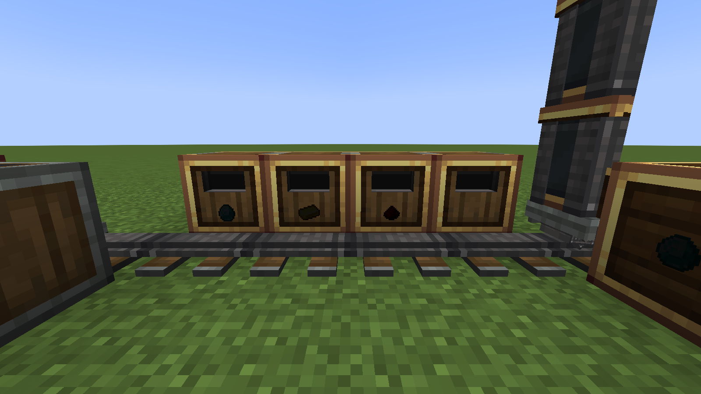

**Priorities.** *Hold* the click on the same slot to set a priority from **0** to **9**. Among the locations that are
equally suitable, the crane fills the highest one first, so the vault by the door can fill before the far end of the
aisle. The number is drawn on the block while it is not 0, and a Create clipboard copies filter and priority together
down a whole rack wall.

* **Storing only.** Retrieval always takes the nearest source, and raising a priority never moves what is already
  stored. A running job keeps its target.
* **It never overrules a filter**, and it never mixes item types: a dedicated location still wins, and a location that
  already holds the incoming item still wins. The priority decides between the locations that are otherwise equal.

## Production

A **Warehouse Production Station** holds patterns: a 3 × 3 grid of ingredients plus one result. Once a pattern is set,
the result can be ordered at the terminal even at zero stock. The crane delivers the ingredients to the station, your
machine does the work, and the product comes back through an ordinary warehouse input. The terminal shows each order's
state ("waiting for ingredients", "at the machine", "waiting for the result", "complete") and lets you cancel it.
Ingredients that already went into a machine are not recovered.

**And if the ingredients themselves have to be made first, that works too.** Order a button when the warehouse holds
nothing but logs: at the moment you click, the warehouse looks at the patterns your stations hold and works out the whole
chain — planks from logs at your saw, the button from those planks at your crafter — and then either creates **every step
at once** or refuses the click and tells you the item that is really missing ("Oak Log is missing"). Nothing moves until
the whole chain is possible, so the crane never starts carrying logs for something it could not have finished.

* **Every step is an ordinary order at one of your machines, and every intermediate travels through a real rack.** The
  crane brings the logs to your saw, the planks come back through a warehouse input and are **stored**, and the crane then
  fetches those very planks to the next machine. There is no machine-to-machine shortcut and nothing is held invisibly.
  Wareworks still orders; your machines still make everything.
* **A step that is waiting for an earlier step is handed nothing at all.** A machine cannot run on half a set, so a chain
  that goes wrong does not leave part-sets of ingredients sitting in three machines.
* **The terminal shows a chain as one line**, with the step that is actually working named on the right ("now: Oak
  Planks"). Click the line and you get every step with its state and the **rack address of the machine it runs at**, so
  you know which block to walk to — and one button gives the whole chain up, after telling you what that costs.
* **How long a chain may be is up to you, not to a depth setting.** Two server settings bound it instead:
  `maxProductionPlanSteps` (how many orders one click may create — **1 switches chains off entirely**) and
  `maxPlanIngredientItems` (how many ingredient items one click may put into your machines, over every step). A click that
  is too large is made **smaller** rather than refused. A chain that would come back to an item it has already made — two
  patterns that are inverses of each other — is refused before anything is converted.
* **A redstone request can start a chain too**, one at a time per output, so a clock cannot stack chains into the same
  machines while the first one is still working.

**If a machine eats a batch, the warehouse stops making that item — and says so where the machine is.** This now covers
every kind of order: your own click, a redstone request, a step of a chain and the warehouse's own restocking. The station
in front of the machine lights a red ring around its openings, its goggles and its screen name the item and what the loss
cost, the controller and an aisle display count it, and ordering it again is refused with "the warehouse has stopped making
it" instead of "not in stock". Check the machine, then **sneak-right-click the station** or click the red row in its
screen, and it makes the item again — and you are told how many ingredients were delivered and never came back. It
never retries by itself.

| | |
|---|---|
| 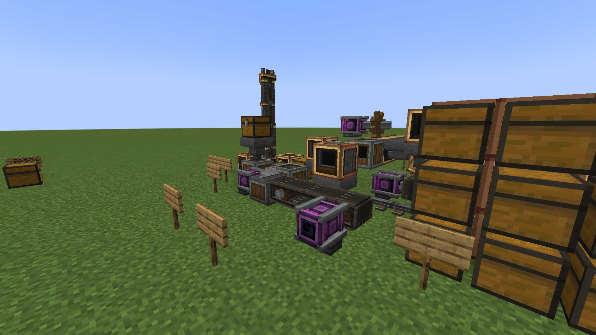 | 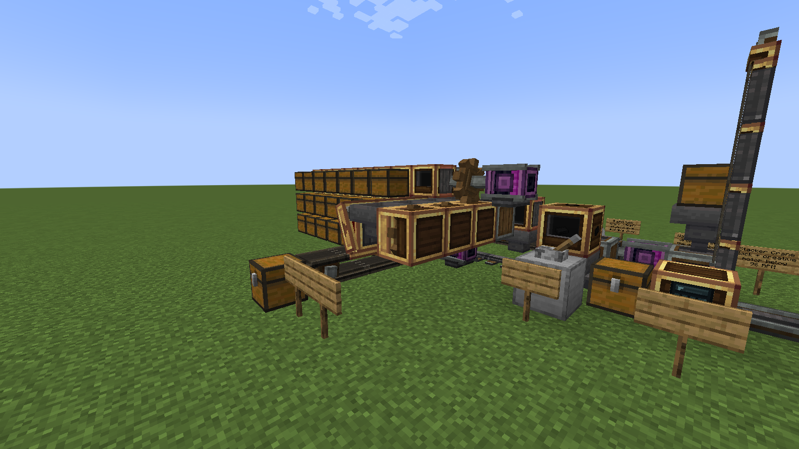 |
| **Sawmill:** station → hopper → belt → Mechanical Saw → warehouse input. Pattern: 1 andesite alloy → 6 shafts. | **Mechanical crafters:** station → belt → three filtered brass funnels → hoppers → Mechanical Crafters → warehouse input. |

Practical notes:

* **A Mechanical Arm can feed your machine straight from the station.** Select the production station as the arm's
  source and the machine as its target; the order moves on to "waiting for the result" once the arm has taken the
  ingredients, just as with a funnel.
* **Mechanical crafters need filtered feeds and hopper buffers.** A crafter slot holds exactly one item, so each funnel
  must be filtered to one ingredient. A crafter also accepts nothing while its group is working, so put a hopper
  between each funnel and its crafter to hold the next ingredient.
* **Give a Mechanical Saw a recipe filter.** Saws also run stonecutting recipes and cycle through every matching
  recipe, so an unfiltered saw makes the wrong item most of the time.
* **Wareworks does not check patterns against recipes.** A pattern whose machine cannot make the result never produces
  anything, and the order times out.
* **A step is completed by items really arriving in the warehouse.** Putting the intermediate into a rack by hand does not
  finish a step — that is what keeps the safety stop honest — so let the chain run, or cancel it and order the parts
  separately.
* **"Can be made now" only ever counts one level.** An item that only a chain can make is offered without a number; the
  click then plans the chain exactly and names the item in the way if it cannot.

## Stock rules

A **Warehouse Stock Keeper** is where you tell a warehouse how much of something it should hold. Place it into a rack
like any other station and right-click it with an empty hand: each row takes one item and up to three numbers. Scroll a
number to change it, Shift-scroll for whole stacks, right-click it to switch it off. The row's item is only a name —
nothing you click in is used up, and the keeper itself never holds an item.

The three numbers do three different things:

* **Minimum — what comes in.** "Keep 256 planks." While the warehouse holds fewer, the **comparator** on the keeper
  calls for the item, so a farm or a hand-built line runs exactly as long as it is needed. And if a Warehouse Production
  Station in the same aisle has a pattern for the item, the warehouse **orders it by itself**: the crane fetches the
  ingredients to the station, your machine makes the product, and it comes back through an ordinary warehouse input. One
  number is all of it — no second setting, no schedule. The warehouse usually settles a little above your number,
  because a pattern makes whole runs — but never above a maximum you also set, and never by spending something another
  rule is itself short of. If your numbers leave no room for a whole run ("keep exactly 64, made four at a time"), the
  row says so instead of ordering.
* **Maximum — what may be stored.** "Store at most 2048 cobblestone." Above it the crane stops accepting the item, and a
  warehouse input holding it **backs up on purpose**: that is the rule working, not a jam. The controller's goggles and
  an aisle display say so ("At maximum: 1"), and nothing that is already stored is ever thrown away or moved out.
* **Reserve — what may go out to automation.** "Never let the last 64 andesite alloy go to a machine." A redstone request
  at a Warehouse Output stops at the reserve, and so do the ingredients of anything the warehouse makes for itself.
  **You are never stopped:** a request at a terminal is served down to the last item, and the row tells you that you are
  going below the reserve.

**If a machine eats a batch, the warehouse stops.** Ingredients that have gone into one of your machines cannot be
recovered. So the first time an order ends with the ingredients delivered and nothing coming back — a broken
machine, an unpowered one, a pattern that machine cannot make — the warehouse **stops making that item** and waits for
you: a differently coloured lamp on the keeper, a red ring on the production station in front of the machine, a stopped
line in the goggles of both, on the controller and on an aisle display, and the row in either screen tells you what the
loss cost. Check the machine, then click the keeper row's mark (or simply edit the rule again), or sneak-right-click the
production station, and it makes the item once more. It never retries by itself, because it cannot tell a fixed machine
from a broken one. The stop covers **every** kind of order — your own click and a redstone request as well as the
warehouse's own restocking — and it blocks planning too, so the next click cannot quietly rebuild the same chain into the
same broken machine.

**The terminal asks before one of your own clicks crosses a line you drew.** A click that reaches into a reserve, spends
a reserved item as the **ingredient** of something the warehouse has to make for you, or would leave more in the racks
than a maximum allows, opens a short question naming the exact number and item. Hold **Alt** while clicking to skip it.
Nothing is requested until you confirm, and what the answer costs is measured again at that moment, so a warehouse that
moved in the meantime asks you again rather than acting on an old yes.

An aisle may hold several keepers; their rows together are the aisle's rules, up to `maxStockRules` (32 by default). A
second rule for the same item is ignored and says so, so you can always see which row is in charge. Setting
`maxRestockOrders` to 0 in the server config switches the automatic ordering off, while every rule keeps capping and
reserving.

## Chunk loading (for server operators)

A warehouse does things on its own now: it refills its own minimums, hands surplus out through a port and fetches a
machine's result back into storage. All of that stops when the chunks around the aisle stop ticking — which is the moment
you walk away.

Wareworks can keep those chunks loaded, and it is honest about what that means:

> **This is a chunk loader.** It is **switched off** in the shipped configuration, and nothing about it happens until a
> server operator turns it on.

Turn it on by raising `chunkLoading.maxTicketedAislesPerLevel` in `config/wareworks-server.toml` (per world:
`<world>/serverconfig/wareworks-server.toml`). What you get, and what bounds it:

* **Only while the aisle has work.** An aisle holds chunks while its crane has a job, a request is open or a production
  order is running (an automatic restock is one of those). The moment it is idle it lets go — after a short linger, so a
  burst of jobs cannot make it flap. It is never a permanent loader for a warehouse that is standing still.
* **Only its own chunks.** Every aisle's box plus one block on every side, counted once where two aisles share a chunk:
  the controller, the dock, the rails, the racks, the inventories behind them and the machine behind a collecting port.
  Usually 2 to 8 chunks for one straight aisle, 10 to 12 for a warehouse with a corner in it.
* **Three caps, and going over one costs nothing.** `maxTicketedAislesPerLevel` limits how many **warehouses** of one
  dimension may hold at once, `maxChunksPerAisle` how many chunks one whole warehouse may hold (default 10), and
  `maxHoldTicks` how long a single hold may last (1 hour by default) before it lets go and waits for its work to really
  change. (The two keys keep their older names; the unit they count has been one whole warehouse since rails may bend.)
  A warehouse over a cap holds **nothing at all** and behaves exactly as it did before: the crane pauses while its
  chunks are away and continues when they come back. Its goggles say which cap stopped it, with both numbers — and
  lowering a cap under a warehouse that is already holding makes it let go, rather than leaving the hold above the
  number you just set.
* **No crops, no mobs.** Held chunks tick blocks and block entities — the crane, your furnaces, funnels and belts — but
  not random ticks, mob spawning or inhabited time. This loads a warehouse, not a farm. (A forced chunk also lets its
  eight neighbours tick their blocks, exactly as vanilla `/forceload` does, so the loaded area is a little larger than
  the chunk count you are shown.)
* **You can find every ticket.** `/wareworks chunks` (permission level 2, the same as `/forceload`) lists every holding
  **warehouse** of every dimension with its position, its letter, chunk count, reason and age, then the totals and, per
  dimension, how many chunks any mod force-loads there with block tickets next to how many are force-loaded in total. A
  warehouse the per-warehouse cap refused gets a row of its own saying how many chunks it would have needed.
  `/wareworks chunks release <x y z>` frees one warehouse in the dimension you run it in — like every `/forceload`
  subcommand — and `release all` frees every dimension, including the warehouses that were queued behind a cap, so
  nothing at all is left holding. You need this command: `/forceload query` cannot see a mod's tickets.
* **Nothing survives its owner.** Break, replace or remove the warehouse controller and its chunks are released in the
  same tick. A hold does survive a restart on purpose, so a job that was running is still running afterwards — but only
  as a single chunk until the controller has confirmed it still has work, and a hold whose controller is gone is dropped
  with a line in the log. An aisle that let go because its hold ran out of time, or because you released it, stays that
  way across a restart too: it holds again when its work really changes, or once that work is done.

One thing it deliberately cannot do: a **collecting** port only notices its machine while its own chunk ticks, so an
idle aisle with nothing pending unloads and will not see a furnace that finishes later. The separate opt-in
`chunkLoading.maxCollectHoldAislesPerLevel` keeps a collection that is **already running** alive across the gap between
one machine output and the next; it cannot start one. It is a cap of its own, and an aisle waiting behind it says so on
its goggles.

## Building from source

Requires a JDK 21 (`JAVA_HOME` must point to it).

```bash
./gradlew build              # compile, run unit tests, build the jar into build/libs
./gradlew runClient          # development client
./gradlew runServer          # development dedicated server (run/server)
./gradlew runGameTestServer  # in-world GameTests; exit code = number of failures
./gradlew runData            # data generation into src/generated/resources
./gradlew runVisualTest      # client screenshots into run/visual/screenshots
./gradlew runRobustnessTest  # chunk unload, save and rejoin, blocks broken mid-job
./gradlew runShowcase        # builds a playable showcase world into run/showcase/saves
```

On Windows use `gradlew.bat`. To play the showcase world, copy `run/showcase/saves/wareworks_showcase` into `run/saves`,
start `./gradlew runClient` and pick **"Wareworks Showcase"**.

## Documentation

* [Architecture](docs/architecture.md): layers, package tree, design decisions
* [Warehouse system](docs/warehouse-system.md): interface, controller, addressing, stock index, jobs, reservations, stock
  rules, config
* [Stacker crane](docs/stacker-crane.md): block, state machine, kinetics, rendering, sounds
* [Dependencies](docs/dependencies.md): versions, Create APIs in use, known harmless log warnings
* [Roadmap](docs/roadmap.md): milestones and planned features
* [Manual test checklist](docs/manual-test-checklist.md): play-test checks

## AI disclosure

* **Images:** artwork such as the project logo was generated with AI. The screenshots in this README are in-game
  captures.
* **Code:** the code was written with AI assistance.
* **Human review:** every AI-generated part, whether image or code, was reviewed by a human before it was released.

## License

Copyright (C) 2026 Richie1710

Create: Wareworks is released under the [GNU General Public License v3.0](LICENSE) (GPL-3.0-only).

You may use, modify and redistribute it, but copies and modified versions must stay under the same license, keep the
copyright and license notices, and make their source code available.

Create, Ponder, Flywheel and Registrate belong to their respective authors; this addon depends on them and ships none of
their code.
